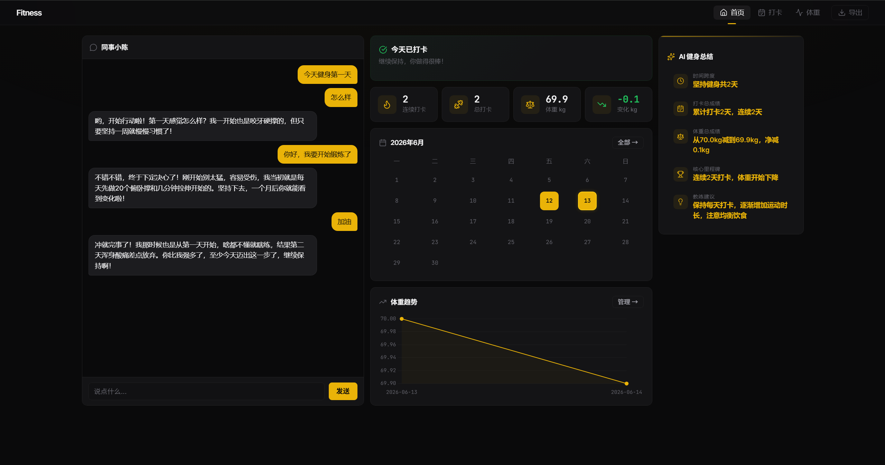
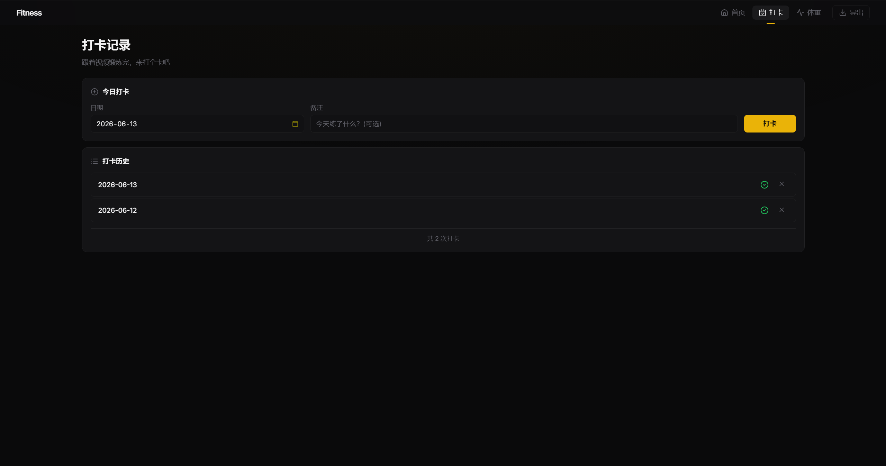
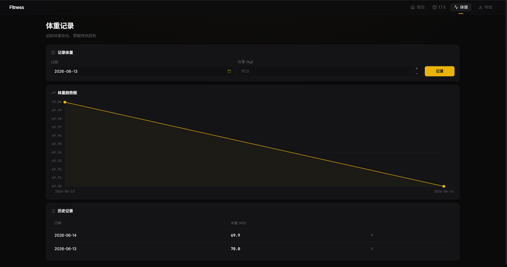

# Fitness Tracker

一个基于 Flask 的个人健身追踪 Web 应用，集成 AI 对话与智能数据分析，帮助你记录和管理健身习惯。


## 效果截图







## 功能特性

### 健身记录管理

- **每日打卡** — 一键打卡，支持添加备注（今天练了什么）
- **体重追踪** — 记录每日体重，同一天自动覆盖更新
- **连续打卡统计** — 自动计算当前连续打卡天数
- **日历视图** — 月历直观展示打卡情况，打卡日高亮标记
- **数据导出** — 一键导出 Markdown 格式的健身报告

### AI 智能功能

- **AI 同事聊天** — 与虚拟"健身同事小陈"实时对话，获得鼓励和健身建议
  - SSE 流式响应，逐字输出
  - 自动注入你的真实健身数据作为上下文
  - 对话历史持久化存储，支持分批加载
- **AI 健身总结** — 基于你的所有数据自动生成结构化分析报告
  - 时间跨度、打卡成绩、体重变化、里程碑、教练建议
  - JSON 格式输出，前端渲染为带图标的可视化卡片
  - 结果缓存在浏览器 `sessionStorage`，避免重复请求

### 数据可视化

- **体重趋势图** — Chart.js 折线图，展示近期体重变化曲线
- **统计面板** — 连续打卡、总打卡、当前体重、体重变化四大核心指标

### 设计特点

- 深色主题，Linear 风格 UI
- 全响应式布局（三栏 / 双栏 / 单栏自适应）
- 无外部 JS 框架依赖，纯原生 JavaScript
- 所有数据以 JSON 文件本地存储，零数据库依赖

## 技术栈

| 组件 | 技术 |
|------|------|
| 后端 | Flask 3.1+ / Python 3.13+ |
| 前端模板 | Jinja2 |
| 图表 | Chart.js 4 (CDN) |
| 图标 | Lucide Icons (CDN) |
| 字体 | Inter / JetBrains Mono (Google Fonts) |
| AI 接口 | OpenAI 兼容 API (SSE 流式) |
| 包管理 | uv |

## 快速开始

### 1. 克隆项目

```bash
git clone https://github.com/zxzhuge/fitness-tracker.git
cd fitness-tracker
```

### 2. 安装依赖

项目使用 [uv](https://docs.astral.sh/uv/) 管理依赖：

```bash
uv sync
```

### 3. 配置环境变量

复制 `.env.example` 并填写你的 API 密钥：

```bash
cp .env.example .env
```

编辑 `.env` 文件：

```env
# AI 聊天模型（与"同事小陈"对话）
LLM_API_KEY=your-api-key
LLM_API_URL=https://api.openai.com/v1
LLM_MODEL=gpt-4o-mini

# AI 总结模型（健身数据分析）
# 可复用上面的配置，也可单独设置
LLM_API_KEY_2=your-api-key
LLM_API_URL_2=https://api.openai.com/v1
LLM_MODEL_2=gpt-4o-mini
```

> 支持任何兼容 OpenAI API 格式的服务（如 DeepSeek、通义千问、Ollama 等），只需修改 `API_URL` 和 `MODEL`。

### 4. 启动服务

```bash
uv run python app.py
```

访问 http://127.0.0.1:5000 即可使用。

## 项目结构

```
fitness-tracker/
├── app.py                  # Flask 应用主文件（全部后端逻辑）
├── pyproject.toml          # 项目依赖配置
├── .env                    # 环境变量（API 密钥等，不入版本库）
├── prompts/
│   ├── system_prompt.md    # AI 聊天人设定义
│   └── chat_template.md    # 健身数据上下文模板
├── templates/
│   ├── base.html           # 基础布局模板
│   ├── index.html          # 仪表盘（统计、日历、图表、聊天、总结）
│   ├── workouts.html       # 打卡记录页
│   └── weight.html         # 体重记录页
├── static/
│   └── style.css           # 全局样式（深色主题）
└── data/                   # 运行时数据（自动生成）
    ├── workouts.json       # 打卡记录
    ├── weight.json         # 体重记录
    └── chats/
        └── history.json    # 聊天历史
```

## API 接口

| 方法 | 路径 | 说明 |
|------|------|------|
| `GET` | `/` | 仪表盘首页 |
| `GET` | `/workouts` | 打卡记录列表 |
| `POST` | `/workouts/add` | 添加打卡（同日期去重） |
| `POST` | `/workouts/<id>/delete` | 删除打卡 |
| `GET` | `/weight` | 体重记录列表 |
| `POST` | `/weight/add` | 添加/更新体重（同日期覆盖） |
| `POST` | `/weight/<id>/delete` | 删除体重 |
| `POST` | `/api/chat` | SSE 流式 AI 聊天 |
| `GET` | `/api/chat/history` | 获取聊天历史 |
| `POST` | `/api/chat/save` | 保存聊天历史 |
| `GET` | `/api/summary` | SSE 流式 AI 健身总结 |
| `GET` | `/export` | 导出 Markdown 报告 |

## 自定义 Prompt

AI 聊天的行为通过 `prompts/` 目录下的 Markdown 文件控制：

- **`system_prompt.md`** — 定义 AI 角色（同事小陈）的性格、说话风格和话题方向
- **`chat_template.md`** — 注入用户健身数据的模板，支持以下占位符：
  - `{total_workouts}` — 总打卡次数
  - `{last_workout_date}` — 最近打卡日期
  - `{current_weight}` — 当前体重
  - `{weight_change}` — 体重变化
  - `{user_message}` — 用户消息

修改这两个文件即可自定义 AI 的人设和上下文，无需改动代码。

## 开发说明

- 服务默认开启 Flask debug 模式，修改代码后自动重载
- `data/` 目录在首次运行时自动创建，无需手动初始化
- 聊天历史保留最近 10 条消息作为 LLM 上下文，完整历史持久化到磁盘
- AI 总结结果缓存在浏览器 `sessionStorage`，刷新页面不会重复请求

## 支持作者

觉得有用的话，打赏作者一杯奶茶呗，谢谢喵！！！

 

## License

[MIT](LICENSE)
